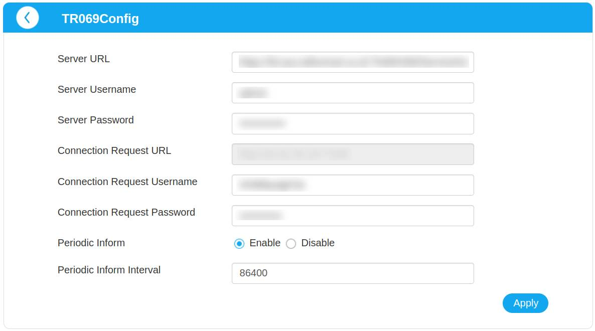

# ZTE MF295N / TR-069

The TR-069 configuration page, normally inaccessible, is located at `index.html#tr069config`. While you can't disable it
entirely, you can edit the `Server URL` field to point to a different, invalid URL. 

This is useful if you want to prevent the router from being automatically configured by your ISP.

(There is probably a way to configure it via `/goform/goform_set_cmd_process`, but I haven't looked into it yet.)